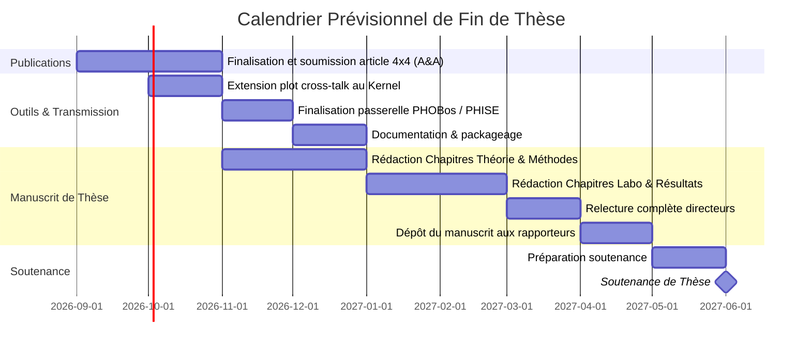

# Préparation du Comité de Suivi de Thèse (CST / CSI) 2026

**Doctorant :** Vincent Foriel  
**Sujet de thèse :** *Adaptative tunable Kernel-Nulling for direct exoplanet detection*  
**Direction :** Frantz Martinache & David Mary  
**Membres du comité :** Sylvie Robbe-Dubois, Jean-Marc Petit  
**Format :** Présentation orale de 20 minutes maximum + 20-25 minutes de questions/échanges  
**Date :** 2026  

---

## 1. Cadrage et Pédagogie pour le CSI

Les membres du comité (Sylvie Robbe-Dubois, Jean-Marc Petit) ont déjà assisté aux comités précédents : ils connaissent les grandes lignes de la thèse mais **ne sont pas des spécialistes pointus de l'interférométrie d'annulation intégrée active**. Le risque majeur dans une présentation de 20 minutes est de les perdre dans des détails d'algèbre matricielle ou d'instrumentation de laboratoire.

### Notions indispensables à rappeler brièvement (1-2 minutes max)
1. **L'enjeu astrophysique :** Détection directe d'exoplanètes proches de leur étoile hôte (contraste extrême $10^{-4}$ à $10^{-6}$ dans le proche infrarouge, séparation angulaire minuscule).
2. **Le principe du Nulling :** Créer une interférence destructive sur l'axe de l'étoile hôte pour éteindre sa lumière, tout en laissant passer le flux de la planète hors axe.
3. **Le concept de Kernel-Null :** L'interférométrie classique est ultra-sensible aux erreurs de phase (pistons atmosphériques ou défauts instrumentaux). Le Kernel-Null est une observable construite par combinaison linéaire de sorties d'interféromètre, conçue pour être **insensible au premier ordre aux erreurs de phase**.
4. **L'optique intégrée active (MMI 4x4 + TOPAs) :** 
   - Remplacer les miroirs et lignes à retard volumineux par une puce photonique compacte et stable (MMI = Multi-Mode Interferometer, recombine 4 faisceaux).
   - Actionneurs thermo-optiques intégrés (TOPAs = Thermo-Optic Phase Actuators) pour corriger dynamiquement les phases en amont du recombineur.
5. **Métrique de performance :** Bien distinguer le **Null depth brut** ($I_\text{null} / I_\text{bright}$) et la **statistique Kernel** (robustesse et capacité de détection après post-traitement).

### Ce qu'il NE FAUT PAS développer (pour ne pas perdre de temps)
- Ne pas redériver le formalisme complet de Bracewell ou les équations de dispersion de Maxwell.
- Ne pas s'attarder sur les 14 shifters de l'ancienne architecture théorique : se concentrer directement sur l'architecture testée en pratique (4 shifters en entrée + MMI 4x4).
- Éviter d'entrer dans les détails de syntaxe de code de PHOBos ou PltEdit : valoriser leur rôle fonctionnel et d'infrastructure pérenne pour l'équipe.

---

## 2. Déroulé Slide par Slide (Format 20 Minutes)

Budget temps total : 20 minutes pour 13 à 14 slides (~1 min 25 s par slide en moyenne).

```
[00:00 - 03:00] Intro, Rappels & Contexte (Slides 1-3)
[03:00 - 07:30] Théorie & Simulations Numériques : PHISE (Slides 4-5)
[07:30 - 11:30] Banc PHOBos & Calibrations Expérimentales (Slides 6-7)
[11:30 - 15:30] Modélisation CMPCE & Limites Physiques (Slides 8-10)
[15:30 - 17:30] Formations, Conférences & Rédaction (Slides 11-12)
[17:30 - 20:00] Perspectives, Transmission & Calendrier (Slides 13-14)
```

---

### Slide 1 : Titre et Cadre de la Thèse (01:00)
- **Titre :** *Caractérisation, calibration et modélisation d'un interféromètre d'annulation photonique actif pour la détection directe d'exoplanètes*
- **Message clé :** Transition réussie entre l'étude purement numérique des premières années et les résultats expérimentaux complets obtenus en laboratoire sur composant photonique réel.
- **Visuel :** Schéma de principe général (Étoile/Planète $\to$ Télescopes $\to$ Puce photonique active $\to$ Détection).
- **À dire à l'oral :**
  - Rappeler le contexte général : collaboration ANR / Thales Alenia Space / Observatoire de la Côte d'Azur.
  - Annoncer le plan de la présentation : un cheminement logique partant de l'optimisation statistique du signal, passant par la mise en place du banc et son automatisation, pour aboutir à la confrontation directe entre théorie, simulation et mesures réelles en laboratoire.

---

### Slide 2 : Rappels de Contexte et Problématique (01:30)
- **Titre :** Le Défi du Nulling Actif : De la Photonique aux Observables Robustes
- **Message clé :** Pour éteindre l'étoile ($10^{-4}$ à $10^{-6}$), il faut un contrôle de phase nanométrique. La photonique intégrée apporte la stabilité, et le Kernel-Null apporte la robustesse aux résidus de phase.
- **Visuel :** 
  - Schéma simplifié d'un MMI 4x4 avec ses 4 actionneurs thermo-optiques en entrée.
  - Illustration du contraste et de la compensation des défauts par déphasage contrôlé.
- **À dire à l'oral :**
  - Rappeler la différence entre un interféromètre statique (dépendant des tolérances de gravure de la fonderie) et notre composant actif (ajustable via micro-chaufferettes thermo-optiques).
  - Préciser que le MMI 4x4 produit à la fois une sortie sombre (nulling de type double Bracewell) et des sorties en quadrature permettant de former le Kernel-Null.

---

### Slide 3 : Feuille de Route et Bilan du Dernier CSI (00:45)
- **Titre :** Continuité des Travaux depuis le CSI 2025
- **Message clé :** Tous les jalons prévus l'an dernier ont été engagés : passage au banc de test en laboratoire, calibration active, confrontation données réelles/simulations PHISE, et début de rédaction de l'article associé.
- **Visuel :** Tableau synthétique reprenant les objectifs annoncés au CSI 2025 vs réalisations 2026.
- **À dire à l'oral :**
  - "L'an passé, nous avions posé les bases théoriques et commencions le banc. Aujourd'hui, le banc fonctionne, le composant est caractérisé, le simulateur PHISE est calibré sur les données réelles et nos limites instrumentales sont clairement expliquées."

---

### Slide 4 : Modélisation Statistique des Données Kernel (02:00)
- **Titre :** Traitement des Données : Détection Optimale de Neyman-Pearson vs Médiane
- **Message clé :** La médiane empirique des distributions Kernel est quasiment optimale au sens de Neyman-Pearson, et ce à différents régimes de turbulence atmosphérique (piston RMS).
- **Visuels recommandés :** 
  - Courbes ROC comparant le test optimal (rapport de vraisemblance de Neyman-Pearson) et les statistiques usuelles (médiane, moyenne).
  - Évolution des performances en fonction de l'erreur de piston RMS $\Gamma$ (labo vs atmosphère).
- **À dire à l'oral :**
  - Les distributions en sortie de Kernel sous perturbations de phase sont asymétriques et non gaussiennes.
  - La théorie de la décision (lemme de Neyman-Pearson) donne la borne théorique ultime de détection.
  - Résultat fort : la médiane des observables Kernel colle presque parfaitement à cette borne optimale, sans nécessiter d'hypothèses lourdes sur la forme exacte de la distribution de bruit, même sous forte turbulence atmosphérique.

---

### Slide 5 : Réponse Chromatique du Kernel dans PHISE (02:00)
- **Titre :** Effets Chromatiques : Robustesse de la Médiane en Bande Étroite
- **Message clé :** L'implémentation de la dispersion chromatique dans PHISE démontre que les performances de la médiane restent stables jusqu'à au moins 100 nm de largeur de bande spectrale.
- **Visuels recommandés :**
  - Scan en longueur d'onde autour de $\lambda_0 = 1550$ nm (largeurs de bande : monochromatique, 100 nm, 1 µm).
  - Graphique montrant la déformation des distributions Kernel lorsque la bande atteint 1 µm.
- **À dire à l'oral :**
  - En pratique, on n'observe pas à une seule longueur d'onde monochromatique : il fallait tester la robustesse face à la dispersion.
  - J'ai introduit la dépendance spectrale fine dans le simulateur PHISE.
  - Conclusion : jusqu'à $\Delta\lambda \sim 100$ nm, l'approximation reste excellente et la médiane conserve son pouvoir de réjection. Au-delà (vers $1$ µm), les asymétries chromatiques modifient substantiellement les lois de distribution.

---

### Slide 6 : Contrôle du Banc Expérimental : Le Logiciel PHOBos (02:00)
- **Titre :** Environnement de Laboratoire : PHOBos et Banc Photonique
- **Message clé :** Développement d'un écosystème logiciel complet, modulaire et orienté objet en Python pour piloter tous les instruments du banc de façon automatisée et reproductible.
- **Visuels recommandés :**
  - Photo du banc optique (remerciement explicite à Marc-Antoine Martinod pour le montage physique).
  - Schéma d'architecture logicielle de **PHOBos** (modules matériel : C-RED 3, actionneurs piézo/moteurs, miroirs déformables BMC, shifters thermiques) et mention de l'utilitaire **PltEdit**.
- **À dire à l'oral :**
  - Pour acquérir des millions de points de calibration de manière fiable, il fallait un contrôle commande robuste.
  - PHOBos regroupe acquisition, synchronisation du matériel, pré-traitement des trames caméra, et sauvegarde standardisée.
  - L'outil annexe PltEdit permet quant à lui de formater, rééditer et archiver facilement les figures scientifiques post-génération.

---

### Slide 7 : Calibration Active en Labo : Algorithme Hooke & Jeeves (02:00)
- **Titre :** Premiers Résultats sur MMI 4x4 : Franchissement du Seuil des $10^{-3}$
- **Message clé :** L'algorithme d'optimisation directe Hooke & Jeeves permet d'atteindre des profondeurs de null comprises entre $10^{-2}$ et $10^{-3}$, une amélioration nette par rapport aux travaux antérieurs limités à $10^{-2}$.
- **Visuels recommandés :**
  - Courbe de convergence de l'algorithme Hooke & Jeeves sur le banc.
  - Comparaison historique du null depth atteint : Peter Chingaipe ($\sim 10^{-2}$) vs nos résultats actuels ($10^{-2} - 10^{-3}$).
- **À dire à l'oral :**
  - L'algorithme Hooke & Jeeves (développé initialement pour l'architecture 14 shifters) a été transposé avec succès sur notre MMI 4x4 à 4 shifters en entrée.
  - Il explore l'espace des phases appliquées pour minimiser le flux de la voie sombre.
  - Nous atteignons des extinctions régulièrement meilleures que $10^{-3}$ sur le banc brut, marquant un progrès instrumental franc.

---

### Slide 8 : Caractérisation Fine : Le Modèle Matriciel CMPCE (02:00)
- **Titre :** Compréhension des Défauts : Modèle CMPCE et Scan Systématique
- **Message clé :** Un jeu de données de scan systématique (256 combinaisons) permet d'ajuster un modèle matriciel complet incluant les couplages parasites (*cross-talk*).
- **Visuels recommandés :**
  - Équation du modèle : $\vec{E}_\text{out} = \mathbf{C_\text{out}} \mathbf{M} \mathbf{P} \mathbf{C_\text{in}} \vec{E}_\text{in}$ (avec $\mathbf{A} = \mathbf{C_\text{out}} \mathbf{M}$).
  - Diagramme des phaseurs reconstruits en sortie avant et après calibration (mise en évidence de la voie nulle et des quadratures).
- **À dire à l'oral :**
  - Pour aller plus loin que la simple optimisation en aveugle, nous avons modélisé physiquement la puce.
  - En scannant chaque entrée isolément, par paires, par triplets, nous avons reconstruit la réponse en puissance et les déphasages relatifs.
  - Le modèle reproduit avec fidélité les phases d'entrée et les modulations d'interférence, cohérentes avec les corrections de Hooke & Jeeves.
  - *Point critique identifié :* le modèle peine encore à découpler parfaitement la phase exacte des termes de cross-talk hors-diagonale, ce qui nous a poussés à explorer les simulations numériques.

---

### Slide 9 : Réalisme du Simulateur PHISE : Intégration du Modèle et de la Caméra (02:00)
- **Titre :** Banc Virtuel dans PHISE : Détecteur C-RED 3 et Dispersion Spatiale
- **Message clé :** L'intégration des données de laboratoire et de la physique réelle du détecteur dans PHISE reproduit fidèlement les comportements expérimentaux.
- **Visuels recommandés :**
  - Schéma de la modélisation du détecteur : faisceaux gaussiens réimagés sur la grille de pixels de la C-RED 3, bruit de lecture constructeur, soustraction de dark thermique.
  - Courbe superposant les distributions simulées dans PHISE et les distributions expérimentales enregistrées sur PHOBos.
- **À dire à l'oral :**
  - Nous avons fait de PHISE un véritable "jumeau numérique" du banc de laboratoire.
  - En injectant la matrice ajustée et les caractéristiques constructeur de la caméra C-RED 3, les résultats simulés et expérimentaux concordent de manière spectaculaire.
  - Cette fidélité permet d'utiliser la simulation pour isoler individuellement les différents facteurs limitants du banc.

---

### Slide 10 : Limites Fondamentales : Détecteur vs Cross-Talk & Rôle de Hooke & Jeeves (02:30)
- **Titre :** Ce qui Limite le Null : Bruit Détecteur, Cross-Talk et Frontière de Calibrabilité
- **Message clé :** La caméra fixe une limite douce à $10^{-3}$, mais le cross-talk intrinsèque du composant constitue la vraie limite dure. Contrairement aux attentes, Hooke & Jeeves ne peut pas corriger les phases de cross-talk.
- **Visuels recommandés :**
  - Graphique de Nick Cvetojevic : *Null depth théorique atteignable en fonction du niveau de cross-talk (avant vs après calibration Hooke & Jeeves)*.
  - Carte 2D / bootstrap du Null vs cross-talk et erreur de cophasage.
- **À dire à l'oral :**
  - Deux verrous identifiés à $10^{-3}$ :
    1. *Le détecteur :* le bruit de lecture de la C-RED 3 impose un plancher doux vers $10^{-3}$ (battable uniquement sous conditions idéales de flux).
    2. *Le cross-talk optique :* c'est la limite physique fondamentale. Comme l'a noté Frantz Martinache, ce cross-talk est stable sur plusieurs jours et à différentes températures, indiquant qu'il est majoritairement interne au composant (gravure) plutôt qu'externe au banc.
  - *Découverte majeure :* on pensait initialement que l'algorithme Hooke & Jeeves pouvait biaiser les phases pour compenser le cross-talk. Le plot proposé par Nick montre clairement qu'il ne compense que les déséquilibres d'amplitude en entrée, laissant les limites de null inchangées. Ce graphique relie directement les tolérances fonderie (coût) aux performances ultimes.

---

### Slide 11 : Valorisation Scientifique, Conférences et Formations (01:15)
- **Titre :** Activités Scientifiques et Formations Doctorales
- **Message clé :** Heures de formation doctorale validées, participation active à la communauté exoplanètes/nulling européenne, malgré un aléa de santé cet été.
- **Visuel :** Liste synthétique des conférences et état des heures de formation.
- **À dire à l'oral :**
  - Présentations et échanges lors de conférences internationales majeures :
    - Workshop **WITSO** (ESA, octobre 2025).
    - Conférence **LIFE** (novembre 2025).
    - Annulation de la SPIE en juillet 2026 pour raisons médicales.
  - Formations doctorales : quota d'heures requis atteint (quelques démarches administratives de validation finale en cours sur ADUM).

---

### Slide 12 : Rédaction de l'Article 4x4 & Diagnostic TDAH (01:45)
- **Titre :** État d'Avancement de la Rédaction et Contexte Médical Récent
- **Message clé :** Le premier article sur la caractérisation et calibration du MMI 4x4 est en cours de finalisation. La récente pose d'un diagnostic TDAH permet enfin de comprendre les difficultés de concentration et d'engager une dynamique efficace pour le sprint d'écriture.
- **Visuel :**
  - Première page du manuscrit de l'article (*Foriel et al., A&A, "Calibration and characterization of an active photonic nulling interferometer"*).
  - Schéma d'organisation du travail : étapes restantes de rédaction.
- **À dire à l'oral :** *(Voir section 3 pour le détail du discours)*
  - Présenter l'état du papier : structure complète, figures prêtes, révisions d'écriture en cours avec les co-auteurs.
  - Expliquer avec franchise et recul le diagnostic TDAH : identification clinique des blocages attentionnels, mise en place d'un protocole médical (Ritaline) et d'un environnement de travail adapté.
  - Poser cela comme un levier positif et rassurant pour mener à bien la finalisation du papier et du manuscrit.

---

### Slide 13 : Perspectives à Court Terme et Transmission (01:30)
- **Titre :** Perspectives Scientifiques et Pérennisation des Outils
- **Message clé :** Étendre l'analyse du cross-talk au Kernel-Null et livrer un écosystème logiciel documenté et intégré (PHISE $\leftrightarrow$ PHOBos) pour les doctorants et chercheurs suivants.
- **Visuel :** Diagramme d'interaction logicielle : PHOBos (extraction automatique de modèle matriciel sur banc) $\longrightarrow$ PHISE (simulation et optimisation).
- **À dire à l'oral :**
  - *Extension scientifique :* appliquer le plot de Nick reliant cross-talk et limites ultimes non plus seulement au Null brut, mais directement à l'observable Kernel-Null.
  - *Transmission et pérennité :* intégrer un outil dans PHOBos permettant à un nouvel utilisateur d'extraire automatiquement le modèle matriciel d'un composant sur le banc pour l'injecter dans PHISE.
  - Laisser une suite d'outils propres, documentés et interopérables pour que l'équipe capitalise immédiatement sur ces développements sans repartir de zéro.

---

### Slide 14 : Calendrier Prévisionnel vers la Soutenance (01:30)
- **Titre :** Rétroplanning de Fin de Thèse
- **Message clé :** Planning réaliste et séquencé jusqu'à la soutenance, articulé autour de la soumission du papier et de la rédaction du manuscrit.
- **Visuel :** Diagramme de Gantt / Frise chronologique (septembre 2026 $\to$ soutenance).
- **À dire à l'oral :**
  - Détailler les échéances clés :
    - *Automne 2026 :* Soumission de l'article MMI 4x4 (A&A) & finalisation de l'outil d'extraction PHOBos/PHISE.
    - *Hiver 2026-2027 :* Rédaction intensive du manuscrit de thèse (structuré autour des 3 piliers : modélisation statistique, banc/PHOBos, et confrontation expérimentale).
    - *Printemps 2027 :* Relecture par les directeurs, envoi aux rapporteurs, soutenance.

---

## 3. Guide Spécifique : Comment Présenter le Diagnostic TDAH

Le CSI est un **comité bienveillant** dont le rôle officiel est de veiller au bon déroulement de la thèse et à la santé du doctorant. La question du diagnostic TDAH doit être abordée de manière stratégique et constructive.

### Deux stratégies possibles

| Stratégie | Avantages | Inconvénients | Recommandation |
| :--- | :--- | :--- | :--- |
| **Option A : En slide publique (Slide 12)** | Totale transparence, dédramatisation, permet d'expliquer directement le décalage dans le calendrier de rédaction devant tout le monde. | Peut attirer des questions médicales non sollicitées pendant la session scientifique de 20 min. | **À formuler brièvement et de façon orientée solution.** |
| **Option B : Pendant l'entretien individuel à huis clos** | Cadre intime et réglementaire prévu par l'école doctorale (sans les encadrants), confidentialité totale. | Laisse le flou pendant les 20 premières minutes sur les raisons du retard rédactionnel. | **Complément indispensable à l'Option A.** |

### Formulation recommandée à l'oral (Courte, professionnelle, positive) :
> *"Concernant la rédaction de l'article et du manuscrit, j'ai rencontré d'importantes difficultés de rythme et de concentration ces derniers mois. La cause a récemment été clarifiée par un diagnostic médical de TDAH. C'est un élément important et rassurant, car cela a permis d'initier une prise en charge adaptée (notamment médicamenteuse avec la Ritaline) et de repenser mon cadre de travail quotidien. Cela me donne aujourd'hui les clés et la visibilité nécessaires pour aborder le sprint final de rédaction avec sérénité et efficacité."*

### Ce qu'il faut retenir :
- **Ne pas s'excuser ni s'attarder :** Le TDAH est un fait neurobiologique, pas un manque de volonté.
- **Mettre en avant la solution :** Le diagnostic est un soulagement et un plan d'action (médication + méthodes de travail structurées).
- **Profiter de l'entretien à huis clos :** Le formulaire officiel du CSI comporte une section spécifique sur les conditions de travail et la santé ; c'est le moment idéal pour détailler vos besoins éventuels avec Sylvie Robbe-Dubois et Jean-Marc Petit.

---

## 4. Questions Probables du CSI et Réponses Clés

### Q1 : *"Pourquoi le cross-talk serait-il interne au composant plutôt que lié au banc ?"*
- **Réponse :** "Sur le banc optique, les fluctuations thermiques et mécaniques varient au cours des heures et modifient l'alignement. Or, comme l'a relevé Frantz Martinache, les matrices de cross-talk extraites sur plusieurs jours consécutifs et à des températures différentes présentent des composantes de phase extrêmement stables et régulières. Si le cross-talk était dominé par l'injection ou les fibres amont, il varierait beaucoup plus avec les réalignements."

### Q2 : *"Le détecteur C-RED 3 limite-t-il définitivement vos mesures à $10^{-3}$ ?"*
- **Réponse :** "C'est une limite dite 'douce' : avec des temps d'intégration plus longs ou dans des conditions idéales de flux où le bruit de lecture devient négligeable devant le photon noise, on peut théoriquement descendre sous $10^{-3}$. En revanche, la limite fixée par le cross-talk interne est une limite 'dure', car elle déforme géométriquement les interférences dans le composant indépendamment de la qualité de la caméra."

### Q3 : *"Qu'apporte concrètement la médiane par rapport à un estimateur classique ?"*
- **Réponse :** "Sous l'effet des pistons de phase atmosphériques résiduels, les distributions de flux ne sont pas gaussiennes mais très asymétriques. La moyenne est fortement biaisée par les excursions de phase importantes. La médiane rejette naturellement ces valeurs extrêmes sans nécessiter d'ajustement paramétrique complexe et colle presque parfaitement au critère optimal de Neyman-Pearson."

### Q4 : *"Le logiciel PHOBos est-il transmissible à d'autres membres de l'équipe ?"*
- **Réponse :** "C'est précisément l'objectif central : PHOBos a été conçu en Python orienté objet avec une documentation en ligne (ReadTheDocs) et un mode 'sandbox' pour tester le code sans le matériel. Mon objectif pour les prochains mois est d'y intégrer une routine automatisée qui caractérise une puce et génère directement son modèle matriciel exploitable par PHISE."

---

## 5. Rétroplanning Rédaction et Soutenance (2026 - 2027)



---

## 6. Synthèse des Messages Forts à Retenir pour l'Oral

1. **Rigueur scientifique :** Les résultats théoriques (Neyman-Pearson, dispersion spectrale) ont guidé la compréhension du banc expérimental.
2. **Impact expérimental :** Franchissement d'un ordre de grandeur de performance par rapport aux prédécesseurs ($10^{-2} \to 10^{-3}$).
3. **Apport méthodologique :** Démonstration que l'algorithme Hooke & Jeeves ne compense pas le cross-talk, et mise en évidence du lien direct entre tolérances fonderie et performances astro via le plot de Nick Cvetojevic.
4. **Pérennité pour le laboratoire :** Livraison d'une infrastructure logicielle professionnelle (PHOBos, PHISE, PltEdit) garantissant la continuité des recherches après la thèse.
5. **Maturité personnelle :** Diagnostic et prise en charge médicale assumés, vision claire et calendrier maîtrisé pour la rédaction et la soutenance.
